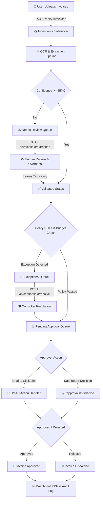

<div align="center">

# 🛡️ FinGuard
### Enterprise AI-Powered Accounts Payable, Invoice Governance & Expense Automation Platform

[](https://www.python.org/)
[](https://fastapi.tiangolo.com/)
[](https://www.mongodb.com/)
[](LICENSE)
[](backend/tests/)

<p align="center">
  <b>FinGuard</b> is a production-grade, multi-tenant financial governance backend that automates invoice ingestion, intelligent OCR extraction, policy compliance enforcement, human-in-the-loop exception handling, and 1-click cryptographic email approvals.
</p>

[Key Features](#-key-features) • [Architecture](#-architecture--lifecycle) • [API Reference](#-api-reference) • [Getting Started](#-getting-started) • [Test Suites](#-automated-testing-suites) • [Security & Compliance](#-security--multi-tenancy)

</div>

---

## 🌟 Key Features

### 🏢 1. Strict Multi-Tenancy & Anti-IDOR Defense
- Complete data isolation per organization enforced at the database layer (`organization_id`).
- Cross-tenant resource queries return `404 NOT_FOUND` via `assert_org_access` to eliminate resource existence leakage.

### 📄 2. Intelligent Invoice Ingestion & OCR Pipeline
- Multipart batch upload supporting PDF and image formats (`.pdf`, `.png`, `.jpg`, `.jpeg`, `.webp`).
- Pluggable OCR engines (Mock, Microservice HTTP, Google Document AI / AWS Textract).
- Automatic confidence scoring (`vendor_name`, `invoice_number`, `invoice_date`, `subtotal`, `tax`, `total`).
- Human-in-the-loop review queue for low-confidence extractions (< 85%).

### ⚙️ 3. Policy Rule Engine & Budget Controls
- Real-time compliance verification against department monthly spend limits.
- Exact and fuzzy duplicate invoice detection.
- Mathematical tax reconciliation (`subtotal + tax == total`).
- Unregistered vendor detection & compliance policy gates.

### 📧 4. 1-Click Cryptographic Action Tokens
- Time-limited HMAC-SHA256 email action tokens allowing managers to approve or reject invoices directly from email without requiring platform login.
- Anti-replay validation prevents double-decision submissions.

### 🧠 5. Machine-Learned Vendor Normalization & Taxonomy
- String normalization and deduplication for vendor names (e.g. `"Apple Inc."` $\rightarrow$ `"apple inc"`).
- Category auto-learning loop: Human overrides automatically train persistent `CategoryOverride` rules.

### ⚡ 6. Real-Time WebSockets & Audit Logs
- Live WebSocket channel (`/api/v1/ws`) broadcasting real-time status transitions to connected clients.
- Append-only, tamper-proof audit trail capturing all user actions, actor IPs, timestamps, and state diffs (`before` / `after`).

---

## 🏗 Architecture & Lifecycle



---

## 🔐 Security & Multi-Tenancy

FinGuard is engineered to meet strict enterprise financial compliance standards:

| Security Domain | Implementation | Standard |
| :--- | :--- | :--- |
| **Password Security** | Passlib `bcrypt` (12 rounds) + salt | OWASP ASVS 4.0 |
| **ERP Credential Encryption** | AES-256-GCM authenticated encryption | NIST SP 800-38D |
| **Session Security** | Rotated `HttpOnly; Secure; SameSite=Strict` cookies | Zero Session Hijacking |
| **Brute-Force Protection** | 5 failed consecutive attempts $\rightarrow$ 15-min account lock | HTTP `423 Locked` |
| **Token Breach Defense** | Immediate revocation of all user sessions upon token reuse | Session Replay Defense |
| **Tenant Isolation** | Strict `organization_id` scoping on all queries (returns `404`) | Anti-IDOR Compliance |
| **Network Security** | Helmet-style CSP, X-Frame-Options, HSTS, Rate Limiting | OWASP Top 10 |

---

## 📡 API Reference

FinGuard provides 11 modular API routers mounted under `/api/v1`:

```
/api/v1
├── /auth              # Registration, Login, Cookie Rotation, Logout, Google OAuth
├── /users             # Profiles, Password Changes, Active Sessions, Admin RBAC, GDPR Export
├── /organizations     # Org profile & Auto-approval Threshold configuration
├── /invoices          # Multipart batch upload, query filters, review overrides, reprocessing
├── /vendors           # Vendor directory, search filters, normalization & deduplication
├── /categories        # Taxonomy categories & machine-learned vendor overrides
├── /policies          # Department budget rules & policy compliance gates
├── /approvals         # Pending queue, approval decisions & 1-click email action tokens
├── /exceptions        # Duplicate & budget exception queue & override resolution
├── /reports           # Spend summary, Month-to-Date KPIs, Budget-vs-Actual analytics
├── /audit-logs        # Immutable compliance audit trail with state diffs
└── /ws                # Real-time WebSocket connection & live event streaming
```

> 📖 **Full API Specification:** See [`docs/API_DOCUMENTATION.md`](docs/API_DOCUMENTATION.md) for detailed request/response schemas, error catalogs, and Postman collection integration.

---

## 🚀 Getting Started

### 1. Prerequisites
- **Python 3.12+** (tested up to Python 3.14)
- **MongoDB Atlas** account or local MongoDB 7.0+
- **Redis** (optional, only when running Celery asynchronous queues)

### 2. Installation & Environment Setup

```bash
# Clone the repository
git clone https://github.com/atharva-thedev/FinGuard.git
cd FinGuard/backend

# Create and activate Python virtual environment
python -m venv .venv

# Windows:
.venv\Scripts\activate

# Linux / macOS:
source .venv/bin/activate

# Install dependencies in editable mode
pip install -e ".[dev]"

# Configure environment variables
copy .env.example .env     # On Windows
cp .env.example .env       # On Linux / macOS
```

### 3. Configure `.env`
Edit `backend/.env` with your MongoDB connection string and security keys:

```env
APP_ENV=development
PORT=5000
MONGODB_URI=mongodb+srv://<user>:<password>@cluster0.mongodb.net/?retryWrites=true&w=majority
MONGODB_DB=finguard

JWT_ACCESS_SECRET=your_64_character_hex_access_token_secret_string_here
JWT_REFRESH_SECRET=your_64_character_hex_refresh_token_secret_string_here
ENCRYPTION_KEY=0123456789abcdef0123456789abcdef0123456789abcdef0123456789abcdef
```

### 4. Run the Development Server

```bash
uvicorn app.main:app --reload --port 5000
```

- **API Liveness Probe:** [http://localhost:5000/health](http://localhost:5000/health)
- **Database Readiness Probe:** [http://localhost:5000/ready](http://localhost:5000/ready)
- **Interactive Swagger UI:** [http://localhost:5000/docs](http://localhost:5000/docs)
- **Redoc Documentation:** [http://localhost:5000/redoc](http://localhost:5000/redoc)

---

## 🧪 Automated Testing Suites

FinGuard includes a comprehensive test harness validating the entire API surface against **live MongoDB Atlas clusters**:

```powershell
cd backend

# 1. Full E2E Lifecycle Suite (All 7 Invoicing Scenarios + Live DB checks)
.venv\Scripts\python scripts/run_live_e2e_verification.py

# 2. Negative, RBAC & Multi-Tenant IDOR Suite (30+ Security Boundary Tests)
.venv\Scripts\python scripts/run_negative_edge_cases_verification.py

# 3. Deep Features & Real-Time WebSockets Suite (User Management & WS Ping/Pong)
.venv\Scripts\python scripts/run_remaining_endpoints_verification.py

# 4. External Integrations Suite (Google OAuth, SMTP Engine & HTTP OCR Provider)
.venv\Scripts\python scripts/run_external_integrations_verification.py

# 5. Pytest Unit & Integration Suite
.venv\Scripts\pytest tests/ -v
```

---

## 📮 Postman Collection

Import the pre-configured Postman workspace located at:
- **Collection:** [`backend/postman/collection.json`](backend/postman/collection.json)
- **Environment:** [`backend/postman/environment.json`](backend/postman/environment.json)

---

## 📂 Project Structure

```
FinGuard/
├── .agents/                    # Agentic skills, rules & MCP configurations
│   ├── rules/                  # Continuous API documentation sync rule
│   └── skills/                 # FinGuard backend runner automation
├── backend/
│   ├── app/
│   │   ├── config/             # Environment settings & MongoDB Atlas connection
│   │   ├── core/               # Error envelope, response wrappers, bcrypt security
│   │   ├── domain/             # Taxonomy engine & deterministic invoice validation rules
│   │   ├── middleware/         # Security headers, rate limiter, auth & RBAC guards
│   │   ├── models/             # Beanie / Pydantic document schemas (User, Invoice, etc.)
│   │   ├── modules/            # 11 Modular Feature Routers, Schemas & Services
│   │   ├── realtime/           # WebSocket Hub & real-time event broadcasting
│   │   └── utils/              # JWT, AES-256-GCM, Naive UTC Datetimes, Audit logger
│   ├── postman/                # Postman v2.1 Collection & Environment
│   ├── scripts/                # Live E2E, Negative & Integration verification suites
│   ├── tests/                  # Pytest unit & integration test cases
│   └── pyproject.toml          # Project dependencies & package metadata
├── docs/
│   ├── API_DOCUMENTATION.md    # Complete HTTP API specification & remediation runbook
│   └── BACKEND_PLANNING.md     # Architecture design document
├── .agentsignore               # Agent context ignore rules
├── .gitignore                  # Git repository ignore rules
├── Finguard_prd.md             # Comprehensive Product Requirements Document
├── LICENSE                     # MIT License
└── README.md                   # Repository landing page
```

---

## 📄 License

This project is licensed under the **MIT License** — see the [LICENSE](LICENSE) file for details.
