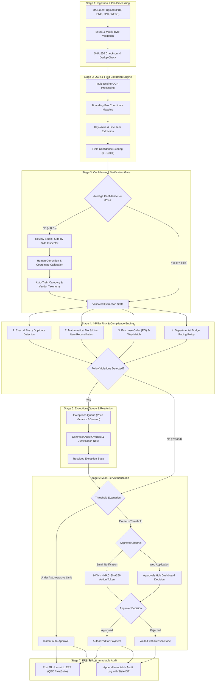

<div align="center">

# FinGuard
### Enterprise AI-Powered Accounts Payable, Invoice Governance & Expense Automation Platform

[](https://www.python.org/)
[](https://fastapi.tiangolo.com/)
[](https://reactjs.org/)
[](https://vitejs.dev/)
[](https://www.mongodb.com/)
[](LICENSE)

<p align="center">
  <b>FinGuard</b> is an enterprise accounts payable intelligence platform combining an asynchronous FastAPI backend with a modern React 18 interface. It provides end-to-end invoice lifecycle automation: multipart batch ingestion, intelligent OCR extraction with bounding boxes, continuous 3-way matching, multi-rule policy enforcement, interactive exception resolution, cryptographic 1-click email approvals, and automated ERP ledger synchronization.
</p>

[System Architecture](#system-architecture--feature-pipeline) • [Feature Capabilities](#feature-capabilities) • [Frontend Workspaces](#frontend-workspaces) • [Security & Multi-Tenancy](#security--multi-tenancy) • [Getting Started](#getting-started) • [API Reference](#api-reference)

</div>

---

## System Architecture & Feature Pipeline

The following flowchart illustrates the multi-stage scanning, validation, policy enforcement, and approval lifecycle executed for every incoming invoice:



---

## Feature Capabilities

### 1. Intelligent OCR & Document Geometry
- **Pluggable OCR Adapters**: Supports mock extraction, microservice OCR, and cloud engines (Google Document AI / AWS Textract).
- **Bounding-Box Overlays**: Every extracted data point (`vendor_name`, `invoice_number`, `invoice_date`, `subtotal`, `tax`, `total`, `line_items`) retains exact pixel coordinates for visual document alignment.
- **Confidence Scoring**: Field-level confidence scores (0–100%) calculate weighted reliability. Invoices below 85% confidence automatically route to the **Review Studio**.

### 2. Continuous 3-Way Matching Engine
- **PO Line Item Alignment**: Matches line items against enterprise Purchase Orders (POs) and Goods Receipt Notes (GRNs).
- **Tolerance Thresholds**: Configurable price variance and quantity discrepancy limits prevent unauthorized cost escalations.
- **Mathematical Tax Reconciliation**: Validates line-item sums against `subtotal + tax == total` with tolerance for rounding anomalies.

### 3. Fraud Prevention & Risk Detection
- **Fuzzy Duplicate Detection**: Levenshtein distance matching identifies duplicated submissions even with slight OCR variations or altered invoice numbers.
- **Vendor Spoofing Alerts**: Detects sudden vendor bank account or address modifications.
- **Department Budget Pacing**: Real-time evaluation against departmental monthly spending caps, blocking overruns before invoice commitment.

### 4. 1-Click Cryptographic Approvals
- **HMAC-SHA256 Action Tokens**: Generates time-limited (7-day), cryptographically signed action links embedded in approval emails.
- **Zero-Login Decisioning**: Authorizers can approve or reject invoices directly from their email client on mobile or desktop without entering platform credentials.
- **Replay Attack Defense**: Nonce rotation and database execution locks prevent double submissions.

### 5. Multi-Tenant Architecture & Anti-IDOR Defense
- **Organization Isolation**: Every query is strictly filtered by `organization_id` at the database index layer.
- **Information Leakage Prevention**: Cross-tenant resource queries return `404 NOT_FOUND` via `assert_org_access` rather than `403 Forbidden`, eliminating resource existence probes.
- **Enterprise Cryptography**: Passwords hashed with `bcrypt` (12 rounds); ERP integration secrets encrypted with `AES-256-GCM`.

### 6. Append-Only Tamper-Proof Audit Trails
- Every status transition, human override, approval decision, and ERP synchronization writes an immutable audit record containing actor ID, IP address, timestamp, action type, and before/after state diffs.

---

## Frontend Workspaces

The frontend is a single-page application built with **React 18**, **TypeScript**, **Vite**, and styled with an enterprise **monochromatic grayscale scale (1000 - 100)** and exclusive **HK Guise** typography:

### Authenticated Workspace Modules
| Workspace | Route | Key Capabilities |
| :--- | :--- | :--- |
| **Dashboard** | `/dashboard` | Executive KPIs, spend volume, risk distribution, cash-flow metrics, and recent activity stream. |
| **Capture & Ingest** | `/capture` | Drag-and-drop batch upload, file format validation, instant OCR preview, and processing status. |
| **Invoices Queue** | `/invoices` | Filterable invoice ledger by vendor, status, date range, and risk score. |
| **Review Studio** | `/invoices/:id/review` | Interactive side-by-side document viewer with bounding-box overlays and field editing. |
| **Exceptions Queue** | `/exceptions` | Triaged queue for duplicate submissions, price variances, and budget overruns with single-line status pills. |
| **Approvals Hub** | `/approvals` | Tiered authorization queue with 1-click approvals, delegation workflows, and rejection notes. |
| **Spend & Analytics** | `/reports` | Department spend breakdown, month-over-month trends, and budget pacing visual charts. |
| **Vendors Directory** | `/vendors` | Vendor directory with default GL codes, payment terms, risk ratings, and compliance checks. |
| **Audit Logs** | `/audit` | Comprehensive, immutable audit trail with actor details, timestamps, and JSON state diffs. |
| **Settings & Policy** | `/settings` | ERP connector toggles (QuickBooks Online, Oracle NetSuite) and custom policy rules. |

### Public & Marketing Pages
| Page | Route | Key Capabilities |
| :--- | :--- | :--- |
| **Landing Page** | `/` | Hero section, 3-pillar feature strip, interactive preview, and call-to-action banner. |
| **Features** | `/features` | Technical overview of OCR extraction, 3-way matching, and automated workflows. |
| **Security & Trust** | `/security` | SOC 2 Type II, ISO 27001, GDPR, and AES-256-GCM encryption architecture. |
| **Integrations** | `/integrations` | Directory of ERP, accounting, and cloud storage connectors. |
| **Pricing** | `/pricing` | 3-tier plans (Starter, Growth, Enterprise) with monthly/annual billing toggle and interactive card selection. |

---

## Security & Multi-Tenancy

| Security Domain | Implementation | Standard |
| :--- | :--- | :--- |
| **Password Security** | Passlib `bcrypt` (12 rounds) + salt | OWASP ASVS 4.0 |
| **ERP Credential Encryption** | AES-256-GCM authenticated encryption | NIST SP 800-38D |
| **Session Management** | Rotated `HttpOnly; Secure; SameSite=Strict` cookies | Zero Session Hijacking |
| **Brute-Force Protection** | 5 failed consecutive attempts -> 15-min account lock | HTTP `423 Locked` |
| **Token Breach Defense** | Immediate revocation of all user sessions upon token reuse | Session Replay Defense |
| **Tenant Isolation** | Strict `organization_id` scoping on all queries (returns `404`) | Anti-IDOR Compliance |
| **Network Security** | Helmet-style CSP, X-Frame-Options, HSTS, Rate Limiting | OWASP Top 10 |

---

## Getting Started

### Prerequisites
- Node.js 18+ and npm
- Python 3.12+ (for backend)
- MongoDB Atlas cluster or local MongoDB instance

### 1. Installation

```bash
# Clone the repository
git clone https://github.com/atharva-thedev/FinGuard.git
cd FinGuard

# Install frontend dependencies
cd frontend && npm install && cd ..
```

### 2. Running Frontend Locally

```bash
# From repository root:
npm run dev

# Or from frontend directory:
cd frontend && npm run dev
```
Open **`http://127.0.0.1:5173/`** in your browser.

### 3. Running Backend Locally

```bash
cd backend

# Create virtual environment
python -m venv .venv
.venv\Scripts\activate  # Windows (.venv/bin/activate on macOS/Linux)

# Install dependencies
pip install -r requirements.txt

# Start FastAPI server
uvicorn app.main:app --reload --port 8000
```
Backend API will be accessible at **`http://127.0.0.1:8000`** with interactive Swagger documentation at **`http://127.0.0.1:8000/docs`**.

### 4. Running Automated Tests

```bash
# Backend pytest suite (20/20 passing)
cd backend && .venv\Scripts\pytest tests/ -v

# Frontend TypeScript & Vite production build
npm run build
```

---

## API Reference

| Method | Endpoint | Description | Auth Required |
| :--- | :--- | :--- | :--- |
| `POST` | `/api/v1/auth/register` | Register new user and organization | Public |
| `POST` | `/api/v1/auth/login` | Authenticate user and issue JWT | Public |
| `POST` | `/api/v1/auth/refresh` | Refresh short-lived access token | Cookie |
| `POST` | `/api/v1/invoices` | Upload batch invoices for OCR processing | Bearer JWT |
| `GET` | `/api/v1/invoices` | List organization invoices with filters | Bearer JWT |
| `GET` | `/api/v1/invoices/:id` | Get detailed invoice with extraction data | Bearer JWT |
| `PATCH` | `/api/v1/invoices/:id/extraction` | Update extraction corrections (Review Studio) | Bearer JWT |
| `GET` | `/api/v1/exceptions` | List unresolved policy & matching exceptions | Bearer JWT |
| `POST` | `/api/v1/exceptions/:id/resolve` | Override or resolve an exception | Bearer JWT |
| `GET` | `/api/v1/approvals` | List pending approval requests | Bearer JWT |
| `POST` | `/api/v1/approvals/:id/decide` | Approve or reject an invoice in dashboard | Bearer JWT |
| `GET` | `/api/v1/approvals/email-action` | 1-click HMAC email approval/rejection handler | Public (HMAC) |
| `GET` | `/api/v1/audit/logs` | Query organization audit trail | Bearer JWT |
| `GET` | `/api/v1/vendors` | List verified vendors and GL mapping | Bearer JWT |
| `GET` | `/api/v1/reports/summary` | Retrieve KPI analytics and spend summary | Bearer JWT |
| `GET` | `/api/v1/health` | System health check and database connectivity | Public |

---

## Repository Structure

```
FinGuard/
├── Logo/                        # Vector and raster brand assets
│   ├── logo.png                 # Light mode brand logo
│   └── logo-dark.png            # Dark mode high-contrast pure white logo
├── backend/                     # FastAPI enterprise backend
│   ├── app/
│   │   ├── core/                # Security, database, configuration
│   │   └── modules/             # Auth, invoices, rules, approvals, audit
│   ├── postman/                 # Postman Collection & Environment
│   └── tests/                   # Automated pytest suites
├── frontend/                    # React + Vite TypeScript frontend
│   ├── src/
│   │   ├── auth/                # AuthProvider & role-based access
│   │   ├── components/          # Layout, Navigation, Modals, ThemeToggle
│   │   ├── pages/               # Workspaces and public marketing pages
│   │   └── theme/               # Monochromatic grayscale design system
│   └── index.html
├── docs/                        # Specifications, PRD, and API documentation
│   ├── API_DOCUMENTATION.md
│   ├── PRD.md
│   └── THEME_GUIDELINES.md
└── package.json                 # Monorepo root configuration
```

---

## License

This project is licensed under the MIT License — see the [LICENSE](LICENSE) file for details.
