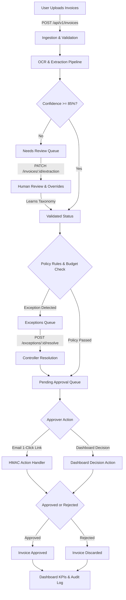

<div align="center">

# FinGuard
### Enterprise AI-Powered Accounts Payable, Invoice Governance & Expense Automation Platform

[](https://www.python.org/)
[](https://fastapi.tiangolo.com/)
[](https://reactjs.org/)
[](https://vitejs.dev/)
[](https://www.mongodb.com/)
[](LICENSE)

<p align="center">
  <b>FinGuard</b> is a production-grade, multi-tenant financial governance system featuring an asynchronous FastAPI backend and a responsive React frontend with automated OCR extraction, 3-way matching, policy enforcement, human-in-the-loop exception handling, and 1-click approvals.
</p>

[Key Features](#key-features) • [Frontend Application](#frontend-application) • [Architecture](#architecture--lifecycle) • [API Reference](#api-reference) • [Getting Started](#getting-started) • [Security & Compliance](#security--multi-tenancy)

</div>

---

## Key Features

### 1. Strict Multi-Tenancy & Anti-IDOR Defense
- Complete data isolation per organization enforced at the database layer (`organization_id`).
- Cross-tenant resource queries return `404 NOT_FOUND` via `assert_org_access` to eliminate resource existence leakage.

### 2. Intelligent Invoice Ingestion & OCR Pipeline
- Multipart batch upload supporting PDF and image formats (`.pdf`, `.png`, `.jpg`, `.jpeg`, `.webp`).
- Pluggable OCR engines with bounding-box extraction.
- Automatic confidence scoring across key fields (`vendor_name`, `invoice_number`, `invoice_date`, `subtotal`, `tax`, `total`).
- Human-in-the-loop review studio for extractions requiring verification.

### 3. Policy Rule Engine & Budget Controls
- Real-time compliance verification against department monthly spend limits.
- Exact and fuzzy duplicate invoice detection.
- Mathematical tax reconciliation (`subtotal + tax == total`).
- Unregistered vendor detection & compliance policy gates.

### 4. 1-Click Cryptographic Action Tokens
- Time-limited HMAC-SHA256 email action tokens allowing managers to approve or reject invoices directly from email without requiring platform login.
- Anti-replay validation prevents double-decision submissions.

### 5. Machine-Learned Vendor Normalization & Taxonomy
- String normalization and deduplication for vendor names.
- Category auto-learning loop: Human overrides automatically train persistent `CategoryOverride` rules.

### 6. Comprehensive Audit Logs
- Append-only, tamper-proof audit trail capturing all user actions, actor IPs, timestamps, and state diffs (`before` / `after`).

---

## Frontend Application

The user interface is built with **React 18**, **TypeScript**, and **Vite**, configured with an enterprise design system:

- **Monochromatic Grayscale Palette (1000 - 100)**: Clean, high-contrast dark and light modes with preserved status indicators (Green for resolved/success, Yellow for action required/warning, Red for critical/mismatch).
- **Typography**: Exclusive **HK Guise** typeface integration.
- **Interactive Workspaces**:
  - **Dashboard**: High-level financial KPIs, processing volume, cash-flow run rate, and real-time activity stream.
  - **Capture & Ingest**: Drag-and-drop batch upload supporting instant OCR preview and confidence tagging.
  - **Review Studio**: Side-by-side interactive document inspector with bounding box highlight overlays and field-level confidence indicators.
  - **Exceptions Queue**: Triaged view of duplicate submissions, price variances, and budget overruns with one-click override and resolution logging.
  - **Approvals Hub**: Threshold-based authorization with approval chains and rejection note capture.
  - **Spend & Analytics**: Departmental spend allocation, risk breakdown, and monthly budget pacing charts.
  - **Vendors Directory**: Verified vendor profiles, default GL codes, payment terms, and compliance flags.
  - **Audit Logs**: Immutable timeline of all system actions, state transitions, and actor metadata.
  - **Settings & ERP**: ERP synchronization toggles (QuickBooks Online, Oracle NetSuite) and custom policy rules.
- **Public & Marketing Pages**:
  - **Landing Page (`/`)**: Hero section, 3-pillar feature strip, interactive preview, and dynamic call to action.
  - **Features (`/features`)**: Deep-dive into OCR extraction, 3-way matching, and automated workflows.
  - **Security & Trust (`/security`)**: SOC 2 Type II, ISO 27001, GDPR, and AES-256-GCM encryption architecture.
  - **Integrations (`/integrations`)**: Directory of ERP, accounting, and cloud storage connectors.
  - **Pricing (`/pricing`)**: 3-tier plans (Starter, Growth, Enterprise) with monthly/annual billing toggle and interactive card selection.
- **Security & UX Controls**:
  - Sign Out Confirmation Modal protecting against accidental session termination.
  - Theme toggle (Light / Dark / Auto) with zero UI flickering (Anti-FOUC).

---

## Architecture & Lifecycle



---

## Security & Multi-Tenancy

FinGuard is engineered to meet enterprise financial compliance standards:

| Security Domain | Implementation | Standard |
| :--- | :--- | :--- |
| **Password Security** | Passlib `bcrypt` (12 rounds) + salt | OWASP ASVS 4.0 |
| **ERP Credential Encryption** | AES-256-GCM authenticated encryption | NIST SP 800-38D |
| **Session Security** | Rotated `HttpOnly; Secure; SameSite=Strict` cookies | Zero Session Hijacking |
| **Brute-Force Protection** | 5 failed consecutive attempts -> 15-min account lock | HTTP `423 Locked` |
| **Token Breach Defense** | Immediate revocation of all user sessions upon token reuse | Session Replay Defense |
| **Tenant Isolation** | Strict `organization_id` scoping on all queries (returns `404`) | Anti-IDOR Compliance |
| **Network Security** | Helmet-style CSP, X-Frame-Options, HSTS, Rate Limiting | OWASP Top 10 |

---

## Getting Started

### Prerequisites
- Node.js 18+ and npm
- Python 3.12+ (for backend)
- MongoDB Atlas cluster or local MongoDB instance

### 1. Installation

```bash
# Clone the repository
git clone https://github.com/atharva-thedev/FinGuard.git
cd FinGuard

# Install frontend dependencies
cd frontend && npm install && cd ..
```

### 2. Running Frontend Locally

```bash
# From the repository root:
npm run dev

# Or directly in frontend/:
cd frontend && npm run dev
```
Open **`http://127.0.0.1:5173/`** in your browser.

### 3. Running Backend Locally

```bash
cd backend

# Create virtual environment
python -m venv .venv
.venv\Scripts\activate  # Windows (.venv/bin/activate on macOS/Linux)

# Install dependencies
pip install -r requirements.txt

# Run server
uvicorn app.main:app --reload --port 8000
```

### 4. Production Build

```bash
npm run build
```

---

## Repository Structure

```
FinGuard/
├── Logo/                        # Vector and raster brand assets
│   ├── logo.png                 # Light mode brand logo
│   └── logo-dark.png            # Dark mode high-contrast logo
├── backend/                     # FastAPI enterprise backend
│   ├── app/
│   │   ├── core/                # Security, database, configuration
│   │   └── modules/             # Auth, invoices, rules, approvals, audit
│   ├── postman/                 # Postman Collection & Environment
│   └── tests/                   # Automated pytest suites
├── frontend/                    # React + Vite TypeScript frontend
│   ├── src/
│   │   ├── auth/                # AuthProvider & role-based access
│   │   ├── components/          # Layout, Navigation, Modals, ThemeToggle
│   │   ├── pages/               # Dashboard, Capture, Invoices, Exceptions, Approvals, etc.
│   │   └── theme/               # ThemeProvider & monochromatic token system
│   └── index.html
├── docs/                        # Specifications, PRD, and API documentation
│   ├── API_DOCUMENTATION.md
│   ├── PRD.md
│   └── THEME_GUIDELINES.md
└── package.json                 # Monorepo root configuration
```

---

## License

This project is licensed under the MIT License — see the [LICENSE](LICENSE) file for details.
