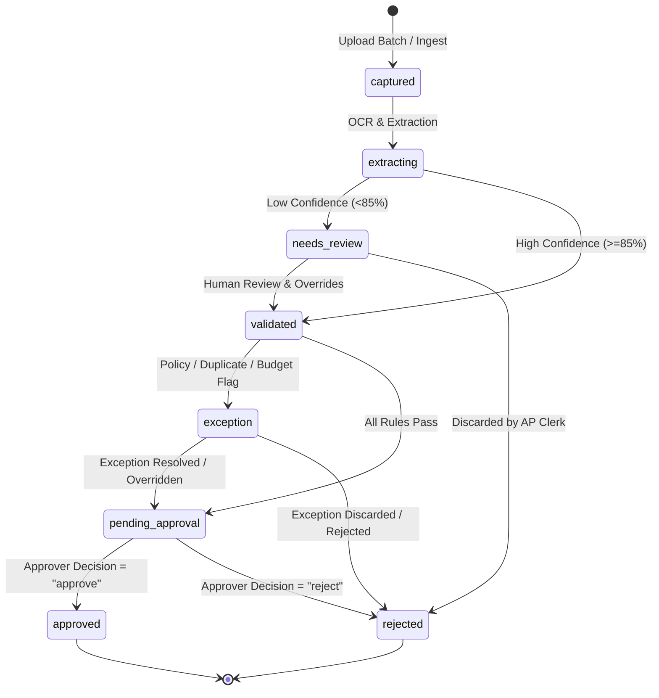

# FinGuard API & Backend Architecture Documentation

> **FinGuard** — Enterprise AI-Powered Automated Invoice Processing, Approval Workflow & Spend Intelligence.  
> **Backend Version:** `1.0.0-MVP` | **Framework:** `FastAPI` (Python 3.12+) | **Database:** `MongoDB Atlas (Beanie ODM)` | **Base URL:** `http://localhost:5000/api/v1`

---

## 📖 Table of Contents
1. [Developer Quickstart & Architecture](#1-developer-quickstart--architecture)
2. [Standard Response & Error Envelopes](#2-standard-response--error-envelopes)
3. [Authentication, RBAC & Security](#3-authentication-rbac--security)
4. [Invoice Processing Scenarios & Lifecycle State Machine](#4-invoice-processing-scenarios--lifecycle-state-machine)
   - [Scenario A: Happy Path Automatic Approval](#scenario-a-happy-path-automatic-approval)
   - [Scenario B: Low Confidence & Human Review (Change/Override)](#scenario-b-low-confidence--human-review-changeoverride)
   - [Scenario C: Rejection / Discard Workflow](#scenario-c-rejection--discard-workflow)
   - [Scenario D: Duplicate Invoice Exception & Resolution](#scenario-d-duplicate-invoice-exception--resolution)
   - [Scenario E: Department Budget Overrun Exception](#scenario-e-department-budget-overrun-exception)
   - [Scenario F: 1-Click Secure Email Approval Action](#scenario-f-1-click-secure-email-approval-action)
5. [Complete API Endpoints Reference](#5-complete-api-endpoints-reference)
   - [System & Health](#51-system--health)
   - [Authentication & Sessions](#52-authentication--sessions)
   - [Users & GDPR](#53-users--gdpr)
   - [Organizations & Thresholds](#54-organizations--thresholds)
   - [Invoices & Batch Upload](#55-invoices--batch-upload)
   - [Vendors](#56-vendors)
   - [Categories & Learning Overrides](#57-categories--learning-overrides)
   - [Policies & Department Budgets](#58-policies--department-budgets)
   - [Approvals Workflow](#59-approvals-workflow)
   - [Exceptions Queue](#510-exceptions-queue)
   - [Reports & Analytics](#511-reports--analytics)
   - [Audit Logs](#512-audit-logs)
   - [Real-time WebSockets](#513-real-time-websockets)
6. [Comprehensive Error Catalog & Remediation](#6-comprehensive-error-catalog--remediation)
7. [Handover Runbook for Developers](#7-handover-runbook-for-developers)

---

## 1. Developer Quickstart & Architecture

### Tech Stack
- **API Runtime:** FastAPI (Asynchronous ASGI application on Uvicorn)
- **Database & ODM:** MongoDB Atlas via Motor async driver & Beanie ODM
- **Validation & Serialization:** Pydantic V2 BaseModels
- **Security:** PyJWT (HS256 access tokens), bcrypt (password & session hashing), AES-256-GCM symmetric encryption
- **Rate Limiting:** SlowAPI (Token bucket with IP / User fallback)
- **Real-Time Engine:** Native Starlette WebSockets with tenant-isolated room broadcasting

### Directory Layout
```text
backend/
├── app/
│   ├── config/             # Environment settings & MongoDB Atlas connection
│   ├── domain/             # Pure business rules (invoice validation, duplicates, taxonomy)
│   ├── middleware/         # Security headers, auth, RBAC guards, global error handler
│   ├── models/             # Beanie ODM MongoDB Document schemas
│   ├── modules/            # Domain API routers, services, schemas
│   │   ├── auth/           # Login, Register, Refresh token rotation, Logout
│   │   ├── users/          # Profile, password, sessions, GDPR export, admin role ops
│   │   ├── organizations/  # Org settings & approval thresholds
│   │   ├── invoices/       # Upload batch, OCR extraction, overrides, pagination
│   │   ├── vendors/        # Vendor directory & normalized indexing
│   │   ├── categories/     # Taxonomies & auto-learning vendor overrides
│   │   ├── policies/       # Budgets & policy enforcement toggles
│   │   ├── approvals/      # Sequential/Parallel approval routing & email tokens
│   │   ├── exceptions/     # Unified exception queue (duplicate, budget, policy)
│   │   ├── reports/        # Spend analytics, budget vs actual variance, dashboard stats
│   │   └── audit/          # Immutable compliance audit trails
│   ├── realtime/           # WebSocket connection hub (/api/v1/ws)
│   ├── notifications/      # SMTP & email dispatching
│   ├── utils/              # Crypto, AES-256-GCM, ownership anti-IDOR checks
│   └── main.py             # FastAPI ASGI entrypoint & lifespan
├── postman/                # Master collection & environment JSON
├── tests/                  # Pytest unit & integration test suites
├── pyproject.toml          # Dependencies & tool configurations
└── .env                    # Local environment secrets
```

### Running Locally
```powershell
cd backend
.venv\Scripts\activate
uvicorn app.main:app --reload --port 5000
```
- **Interactive Swagger Docs:** `http://localhost:5000/docs`
- **ReDoc Reference:** `http://localhost:5000/redoc`

---

## 2. Standard Response & Error Envelopes

Every JSON API response follows a strict, predictable top-level envelope.

### Success Envelope (`2xx`)
```json
{
  "success": true,
  "data": { ... }
}
```

### Error Envelope (`4xx`, `5xx`)
```json
{
  "success": false,
  "error": {
    "code": "VALIDATION_ERROR",
    "message": "Invoice total does not match line item subtotals + tax",
    "fields": [
      {
        "field": "total_amount",
        "message": "Expected 1200.00, calculated 1250.00"
      }
    ]
  }
}
```

---

## 3. Authentication, RBAC & Security

### Token Architecture
1. **Access Token (Short-lived - 15 minutes):**
   - Passed via HTTP header: `Authorization: Bearer <access_token>`
   - Contains payload: `{ "sub": "<user_id>", "org_id": "<organization_id>", "role": "<role>", "exp": ... }`
2. **Refresh Token (Long-lived - 7 days, Rotated):**
   - Transmitted via `HttpOnly; Secure; SameSite=Strict` cookie (`refresh_token=<session_id>.<secret>`).
   - Stored hashed (`bcrypt`) in the `Session` collection.
   - **Reuse Breach Detection:** If a revoked or previously rotated token is reused, all active sessions for that user are revoked immediately.

### Role-Based Access Control (RBAC) Matrix
| Feature / Action | `admin` | `controller` | `approver` | `ap_clerk` | `viewer` |
| :--- | :---: | :---: | :---: | :---: | :---: |
| **Manage Users & Org Settings** | ✅ | ❌ | ❌ | ❌ | ❌ |
| **Configure Policy Rules & Budgets** | ✅ | ✅ | ❌ | ❌ | ❌ |
| **Upload & Reprocess Invoices** | ✅ | ✅ | ❌ | ✅ | ❌ |
| **Review & Override Extraction Fields**| ✅ | ✅ | ❌ | ✅ | ❌ |
| **Approve / Reject Invoices** | ✅ | ✅ | ✅ | ❌ | ❌ |
| **Resolve & Dismiss Exceptions** | ✅ | ✅ | ❌ | ❌ | ❌ |
| **View Invoices, Reports & Audit Logs** | ✅ | ✅ | ✅ | ✅ | ✅ |

### Multi-Tenancy & Anti-IDOR
- Every document is tied to an `organization_id`.
- If User A from Org 1 attempts to read or mutate a resource belonging to Org 2, the API returns **`404 NOT_FOUND`** (never `403 FORBIDDEN`) to prevent leaking resource existence.

---

## 4. Invoice Processing Scenarios & Lifecycle State Machine



---

### Scenario A: Happy Path Automatic Approval
**Context:** Clean invoice, high OCR confidence, registered vendor, within department monthly budget.

1. **Upload:** AP Clerk uploads PDF invoice `invoice_101.pdf`.
   - `POST /api/v1/invoices` $\rightarrow$ Status: `201 Created`, Invoice Status: `captured` $\rightarrow$ `extracting`.
2. **Extraction:** Confidence is 96% (> 85%), vendor matched to "AWS Cloud".
   - Invoice Status: `validated`.
3. **Policy Evaluation:** Rule engine detects amount $450 < $5,000 threshold.
   - Status: `pending_approval`.
4. **Approval:** Department head opens Pending Approvals list and approves.
   - `POST /api/v1/approvals/{approval_id}/decide` with `{"decision": "approve"}` $\rightarrow$ Status: `200 OK`.
   - Invoice Status transitions to `approved`. WebSocket broadcast sent to all org clients.

---

### Scenario B: Low Confidence & Human Review (Change/Override)
**Context:** Scanned receipt with poor lighting; line items are fuzzy, confidence = 71% (< 85%).

1. **Ingest & Extract:** OCR runs. Confidence for `tax_amount` is 65%.
   - Status transitions to `needs_review`.
   - Invoice field `confidence_score` = `0.71`, `low_confidence_fields` = `["tax_amount", "vendor_name"]`.
2. **Review Action (Change/Override):** AP Clerk inspects the image in the UI and corrects the vendor name and tax amount.
   - `PATCH /api/v1/invoices/{invoice_id}/review`
   ```json
   {
     "vendor_name": "Staples Office Supplies",
     "tax_amount": 42.50,
     "total_amount": 342.50,
     "category": "Office Supplies"
   }
   ```
3. **Auto-Learning Feedback Loop:**
   - The system records a `CategoryOverride` mapping "Staples Office Supplies" $\rightarrow$ "Office Supplies" for this organization. Future invoices from Staples are automatically categorized.
4. **Re-Validation:** Confidence is re-computed to 100% (human verified). Invoice transitions to `validated` $\rightarrow$ `pending_approval`.

---

### Scenario C: Rejection / Discard Workflow
**Context:** Non-compliant expense (e.g. personal luxury item submitted under company account).

1. **Submission:** Invoice reaches `pending_approval` queue.
2. **Review:** Approver inspects invoice details via `GET /api/v1/invoices/{id}`.
3. **Discard / Reject:** Approver executes rejection with mandatory audit reason.
   - `POST /api/v1/approvals/{approval_id}/decide`
   ```json
   {
     "decision": "reject",
     "comment": "Personal expense not covered under Corporate Travel & Entertainment policy Section 4.2."
   }
   ```
4. **Result:**
   - Status: `200 OK`.
   - Invoice status transitions to `rejected`.
   - `Approval` record marked `status: "rejected"`.
   - Audit Log created: `action: "invoice_rejected"`, `actor_id: "<approver_id>"`.
   - Real-time notification broadcasted via WebSocket.

---

### Scenario D: Duplicate Invoice Exception & Resolution
**Context:** Vendor accidentally sends the same invoice twice in 2 weeks with different scan dates.

1. **Detection:** During validation, the domain rules engine checks:
   - Exact duplicate check: `vendor_id` + `invoice_number` matches existing record.
   - Fuzzy duplicate check: Same `vendor_id` + identical `total_amount` within 30 days.
2. **Exception Created:**
   - Invoice status set to `exception`.
   - `InvoiceException` record created with `type: "duplicate"`, `severity: "critical"`, `message: "Identical invoice number INV-9801 already paid on 2026-08-10."`
3. **Resolution Pathways:**
   - **Path 1 — Void / Discard Duplicate (AP Clerk / Controller):**
     - `POST /api/v1/exceptions/{exception_id}/resolve`
     ```json
     {
       "action": "dismiss",
       "comment": "Confirmed duplicate submission from vendor. Voided."
     }
     ```
     - Invoice status transitions to `rejected`.
   - **Path 2 — False Positive Override (Controller / Admin only):**
     - `POST /api/v1/exceptions/{exception_id}/resolve`
     ```json
     {
       "action": "override",
       "comment": "Legitimate recurring monthly fee with duplicate identifier. Approved by Controller."
     }
     ```
     - Exception marked `resolved`. Invoice transitions to `pending_approval`.

---

### Scenario E: Department Budget Overrun Exception
**Context:** Engineering department has a monthly budget limit of $50,000. Current spend = $48,000. New invoice = $5,000 (Total $53,000).

1. **Detection:** Rule engine checks `BudgetRule` for `department: "Engineering"`.
   - Projected monthly spend ($53,000) exceeds budget ($50,000).
2. **Exception Raised:**
   - Invoice marked `exception`.
   - Exception record created: `type: "budget"`, `severity: "warning"`, `message: "Engineering department spend exceeds monthly limit by $3,000.00"`.
3. **Escalation & Resolution:**
   - Only a **`controller`** or **`admin`** can resolve a budget exception.
   - `POST /api/v1/exceptions/{exception_id}/resolve` with `action: "override"`.
   - Requires secondary controller sign-off before invoice moves to `pending_approval`.

---

### Scenario F: 1-Click Secure Email Approval Action
**Context:** VP of Finance receives an email notification on mobile with "Approve" and "Reject" buttons.

1. **Email Dispatch:** System signs an HMAC token encoding `{ "approval_id": "...", "decision": "approve", "user_id": "..." }`.
2. **Action Execution:** Approver clicks link in email:
   - `GET /api/v1/approvals/email-action?token=eyJh...`
3. **Verification:**
   - Server verifies token signature, checks if expiration (<48h) is valid, and verifies the approval is still in `pending` state.
   - Decision is applied immediately without requiring credentials login.
   - Returns clean HTML success page + JSON payload.

---

## 5. Complete API Endpoints Reference

### 5.1 System & Health

#### `GET /health`
- **Description:** Basic liveness probe (used by load balancers and Kubernetes).
- **Auth:** Public
- **Status Codes:** `200 OK`
- **Response:**
  ```json
  {
    "status": "ok",
    "service": "finguard-backend",
    "env": "development"
  }
  ```

#### `GET /ready`
- **Description:** Readiness probe that pings the MongoDB Atlas database cluster.
- **Auth:** Public
- **Status Codes:**
  - `200 OK` — Database connected and responding.
  - `503 SERVICE UNAVAILABLE` — Database unreachable.
- **Response (`200 OK`):**
  ```json
  {
    "status": "ready",
    "database": "connected"
  }
  ```

---

### 5.2 Authentication & Sessions

#### `POST /api/v1/auth/register`
- **Description:** Onboards a new company (Organization) and initial Admin user.
- **Auth:** Public | **Rate Limit:** 5 requests/minute
- **Request Body:**
  ```json
  {
    "email": "sarah@acme.com",
    "password": "StrongPassword123!",
    "full_name": "Sarah Connor",
    "organization_name": "Acme Industries"
  }
  ```
- **Status Codes:**
  - `201 CREATED` — Organization created, default taxonomy seeded, access token returned.
  - `409 CONFLICT` — Email already registered (`EMAIL_ALREADY_EXISTS`).
  - `422 UNPROCESSABLE ENTITY` — Password too weak or invalid email format.
- **Response (`201 CREATED`):**
  ```json
  {
    "success": true,
    "data": {
      "access_token": "eyJhbGciOi...",
      "token_type": "Bearer",
      "user": {
        "id": "66ca10...",
        "email": "sarah@acme.com",
        "full_name": "Sarah Connor",
        "role": "admin",
        "organization_id": "66ca09..."
      }
    }
  }
  ```

#### `POST /api/v1/auth/login`
- **Description:** Authenticates user credentials, tracks login sessions, issues access token and secure refresh cookie.
- **Auth:** Public | **Rate Limit:** 10 requests/minute
- **Request Body:**
  ```json
  {
    "email": "sarah@acme.com",
    "password": "StrongPassword123!"
  }
  ```
- **Status Codes:**
  - `200 OK` — Successful authentication.
  - `401 UNAUTHORIZED` — Invalid email or password (`INVALID_CREDENTIALS`).
  - `423 LOCKED` — Account locked after 5 consecutive failed attempts (`ACCOUNT_LOCKED`).
- **Response Headers:**
  `Set-Cookie: refresh_token=<session_id>.<secret>; HttpOnly; Secure; SameSite=Strict; Path=/api/v1/auth`

#### `POST /api/v1/auth/refresh`
- **Description:** Session-backed token rotation. Validates refresh cookie and issues fresh tokens.
- **Auth:** Cookie (`refresh_token`)
- **Status Codes:**
  - `200 OK` — Tokens successfully refreshed and rotated.
  - `401 UNAUTHORIZED` — Missing, expired, or tampered cookie (`INVALID_REFRESH_TOKEN`).
  - `401 UNAUTHORIZED` — Session reuse breach detected; all sessions revoked (`SESSION_REVOKED`).

#### `POST /api/v1/auth/logout`
- **Description:** Revokes the current session from the database and clears the refresh cookie.
- **Auth:** Bearer Token or Cookie
- **Status Codes:** `200 OK`
  ```json
  {
    "success": true,
    "data": { "logged_out": true }
  }
  ```

#### `GET /api/v1/auth/google`
- **Description:** Generates Google OAuth 2.0 authorization redirect URL for Single Sign-On.
- **Auth:** Public
- **Status Codes:**
  - `200 OK` — Returns `{ "auth_url": "https://accounts.google.com/..." }`.
  - `400 BAD REQUEST` — Google OAuth is not configured in backend environment (`INVALID_REQUEST`).

#### `GET /api/v1/auth/google/callback`
- **Description:** OAuth callback endpoint that exchanges the authorization code with Google for tokens, verifies profile, auto-provisions user/organization, and logs the user in.
- **Auth:** Public
- **Query Parameters:**
  - `code` (string, required): Authorization code received from Google.
- **Status Codes:**
  - `200 OK` — Authentication successful; returns access token and sets `refresh_token` HTTP-only cookie.
  - `400 BAD REQUEST` — Google OAuth unconfigured or missing email claim.
  - `401 UNAUTHORIZED` — Failed code exchange or invalid profile tokens.

---

### 5.3 Users & GDPR

#### `GET /api/v1/users/me`
- **Description:** Returns the authenticated user's profile and permissions.
- **Auth:** `require_auth`
- **Status Codes:** `200 OK`, `401 UNAUTHORIZED`

#### `POST /api/v1/users/me/change-password`
- **Description:** Changes user password and revokes all other active sessions for the user.
- **Auth:** `require_auth`
- **Request Body:**
  ```json
  {
    "current_password": "OldPassword123!",
    "new_password": "NewSecurePassword456!"
  }
  ```
- **Status Codes:** `200 OK`, `400 BAD REQUEST` (`BAD_REQUEST`)

#### `GET /api/v1/users/me/sessions`
- **Description:** Lists all active login sessions for the current user.
- **Auth:** `require_auth`
- **Status Codes:** `200 OK`

#### `DELETE /api/v1/users/me/sessions/{session_id}`
- **Description:** Remotely terminates a specific active session.
- **Auth:** `require_auth`
- **Status Codes:** `200 OK`, `404 NOT_FOUND`

#### `GET /api/v1/users/me/export`
- **Description:** GDPR Right of Access export of all user activity, documents, and audit trails.
- **Auth:** `require_auth`
- **Status Codes:** `200 OK` (Returns JSON archive with `user`, `uploaded_invoices`, and `audit_actions`)

---

### 5.4 Organizations & Thresholds

#### `GET /api/v1/organizations/me`
- **Description:** Gets organization profile, approval thresholds, and settings.
- **Auth:** `require_auth`
- **Status Codes:** `200 OK`

#### `PATCH /api/v1/organizations/me`
- **Description:** Updates organization settings and approval thresholds (e.g. invoices under $500.00 auto-approved).
- **Auth:** `require_roles("admin")`
- **Request Body:**
  ```json
  {
    "name": "Acme Global Inc.",
    "approval_threshold": 500.00
  }
  ```
- **Status Codes:** `200 OK`, `403 FORBIDDEN`

---

### 5.5 Invoices & Batch Upload

#### `POST /api/v1/invoices`
- **Description:** Batch multipart file upload for OCR extraction and pipeline ingestion.
- **Auth:** `require_roles("admin", "controller", "ap_clerk")`
- **Payload:** `multipart/form-data` (Field: `files`, up to 50 files, max 25MB total).
- **Status Codes:**
  - `201 CREATED` — Invoices uploaded and queued for extraction.
  - `400 BAD REQUEST` — File exceeds 25MB or unsupported MIME type (`UNSUPPORTED_FILE_TYPE`).
- **Response (`201 CREATED`):**
  ```json
  {
    "success": true,
    "data": {
      "uploaded_count": 2,
      "invoices": [
        {
          "id": "66ca21...",
          "filename": "invoice_august.pdf",
          "status": "extracting"
        }
      ]
    }
  }
  ```

#### `GET /api/v1/invoices`
- **Description:** Paginated invoice list with multi-parameter filtering.
- **Auth:** `require_auth`
- **Query Parameters:**
  - `status`: Filter by status (`captured`, `extracting`, `needs_review`, `validated`, `pending_approval`, `exception`, `approved`, `rejected`)
  - `vendor_id`: Filter by vendor
  - `department`: Filter by department
  - `date_from` / `date_to`: ISO date range filter
  - `page`: Page index (default: `1`)
  - `limit`: Items per page (default: `20`, max: `100`)
- **Status Codes:** `200 OK`

#### `GET /api/v1/invoices/{id}`
- **Description:** Retrieves full invoice metadata, extracted line items, confidence scores, and exception logs.
- **Auth:** `require_auth`
- **Status Codes:** `200 OK`, `404 NOT_FOUND`

#### `PATCH /api/v1/invoices/{id}/extraction`
- **Description:** Human-in-the-loop review override for low-confidence or erroneous OCR extractions.
- **Auth:** `require_roles("admin", "controller", "ap_clerk")`
- **Request Body:**
  ```json
  {
    "vendor_name": "Adobe Inc.",
    "invoice_number": "INV-2026-081",
    "invoice_date": "2026-08-15",
    "due_date": "2026-09-15",
    "subtotal": 1000.00,
    "tax": 100.00,
    "total": 1100.00,
    "category": "Software Subscriptions",
    "department": "Engineering",
    "override_reason": "Corrected OCR misread"
  }
  ```
- **Status Codes:**
  - `200 OK` — Overrides applied, confidences updated to 100%, CategoryOverride learned, invoice re-evaluated.
  - `400 BAD REQUEST` — Validation error.
  - `404 NOT_FOUND` — Invoice not found.

#### `POST /api/v1/invoices/{id}/reprocess`
- **Description:** Re-runs the OCR extraction pipeline on an existing invoice.
- **Auth:** `require_roles("admin", "controller")`
- **Status Codes:** `200 OK`, `404 NOT_FOUND`

#### `DELETE /api/v1/invoices/{id}`
- **Description:** Soft-deletes an invoice and its related approval/exception records.
- **Auth:** `require_roles("admin")`
- **Status Codes:** `200 OK`, `403 FORBIDDEN`, `404 NOT_FOUND`

---

### 5.6 Vendors

#### `GET /api/v1/vendors`
- **Description:** Lists normalized vendor directory for the organization.
- **Auth:** `require_auth`
- **Status Codes:** `200 OK`

#### `POST /api/v1/vendors`
- **Description:** Creates or registers a new vendor.
- **Auth:** `require_roles("admin", "controller", "ap_clerk")`
- **Request Body:**
  ```json
  {
    "name": "Datadog, Inc.",
    "tax_id": "US-12-3456789",
    "default_category": "Cloud Infrastructure",
    "default_department": "Engineering",
    "is_registered": true
  }
  ```
- **Status Codes:** `201 CREATED`, `409 CONFLICT` (`VENDOR_ALREADY_EXISTS`)

---

### 5.7 Categories & Learning Overrides

#### `GET /api/v1/categories`
- **Description:** Retrieves expense categories and default GL codes.
- **Auth:** `require_auth`
- **Status Codes:** `200 OK`

#### `GET /api/v1/categories/overrides`
- **Description:** Lists auto-learned vendor-to-category override rules.
- **Auth:** `require_auth`
- **Status Codes:** `200 OK`

---

### 5.8 Policies & Department Budgets

#### `GET /api/v1/policies/budgets`
- **Description:** Retrieves monthly spend budgets per department.
- **Auth:** `require_auth`
- **Status Codes:** `200 OK`

#### `POST /api/v1/policies/budgets`
- **Description:** Sets or updates a department monthly budget limit.
- **Auth:** `require_roles("admin", "controller")`
- **Request Body:**
  ```json
  {
    "department": "Marketing",
    "monthly_limit": 25000.00,
    "currency": "USD"
  }
  ```
- **Status Codes:** `200 OK`, `403 FORBIDDEN`

#### `GET /api/v1/policies/rules`
- **Description:** Lists active policy compliance rules (e.g. block unregistered vendors, enforce dual approval).
- **Auth:** `require_auth`
- **Status Codes:** `200 OK`

---

### 5.9 Approvals Workflow

#### `GET /api/v1/approvals/pending`
- **Description:** Returns the pending approval inbox for the current approver/controller.
- **Auth:** `require_roles("admin", "controller", "approver")`
- **Status Codes:** `200 OK`

#### `POST /api/v1/approvals/{id}/decide`
- **Description:** Submits an approve or reject decision on an invoice.
- **Auth:** `require_roles("admin", "controller", "approver")`
- **Request Body:**
  ```json
  {
    "decision": "approve",
    "comment": "PO-994 matched. Approved."
  }
  ```
- **Status Codes:**
  - `200 OK` — Decision recorded. If final approver, invoice status becomes `approved`.
  - `400 BAD REQUEST` — Approval already completed (`APPROVAL_ALREADY_DECIDED`).
  - `403 FORBIDDEN` — User is not an assigned approver.
  - `404 NOT_FOUND` — Approval record not found.

#### `GET /api/v1/approvals/action/{token}`
- **Description:** 1-Click secure HMAC action token handler from email notifications (approves or rejects directly).
- **Auth:** Public Token Route
- **Status Codes:** `200 OK`, `401 UNAUTHORIZED` (`TOKEN_EXPIRED`, `TOKEN_INVALID`), `404 NOT_FOUND`

---

### 5.10 Exceptions Queue

#### `GET /api/v1/exceptions`
- **Description:** Lists open exceptions across duplicate invoices, budget overruns, tax mismatches, and policy flags.
- **Auth:** `require_auth`
- **Query Parameters:** `status` (`open`, `resolved`), `type` (`duplicate`, `budget`, `policy`, `missing_fields`)
- **Status Codes:** `200 OK`

#### `POST /api/v1/exceptions/{id}/resolve`
- **Description:** Resolves an exception via override (`force_validate`), pipeline rerun (`reprocess`), or rejection (`reject`).
- **Auth:** `require_roles("admin", "controller")`
- **Request Body:**
  ```json
  {
    "action": "force_validate",
    "notes": "Manager approved one-time budget exception."
  }
  ```
- **Allowed Actions:** `"force_validate"`, `"reprocess"`, `"reject"`
- **Status Codes:** `200 OK`, `400 BAD REQUEST`, `403 FORBIDDEN`, `404 NOT_FOUND`

---

### 5.11 Reports & Analytics

#### `GET /api/v1/reports/dashboard-stats`
- **Description:** Instant dashboard summary KPIs (Month-to-Date Spend, Pending Approvals, Needs Review count, Open Exceptions).
- **Auth:** `require_auth`
- **Status Codes:** `200 OK`
- **Response (`200 OK`):**
  ```json
  {
    "success": true,
    "data": {
      "month": "2026-08",
      "total_spend_month": 48250.00,
      "pending_approvals_count": 4,
      "needs_review_count": 2,
      "open_exceptions_count": 1,
      "approved_invoices_count": 28,
      "total_invoices_count": 35
    }
  }
  ```

#### `GET /api/v1/reports/spend-summary`
- **Description:** Aggregates spend breakdown by Vendor, Department, and Category.
- **Auth:** `require_auth`
- **Query Parameters:** `month=2026-08` (Optional)
- **Status Codes:** `200 OK`

#### `GET /api/v1/reports/budget-vs-actual`
- **Description:** Department-level budget vs actual spend variance analysis and percentage utilization.
- **Auth:** `require_auth`
- **Status Codes:** `200 OK`

---

### 5.12 Audit Logs

#### `GET /api/v1/audit-logs`
- **Description:** Immutable compliance query log for SOC 2 / GDPR audits.
- **Auth:** `require_roles("admin", "controller")`
- **Query Parameters:** `actor_id`, `action`, `resource_type`, `date_from`, `date_to`, `page`, `limit`
- **Status Codes:** `200 OK`, `403 FORBIDDEN`

---

### 5.13 Real-time WebSockets

#### `WS /api/v1/ws?token=<access_token>`
- **Description:** Real-time bi-directional channel for instant UI updates when invoice statuses change.
- **Handshake:** Validates JWT access token in query parameters. Automatically joins the user to their tenant room `org:<organization_id>`.
- **Broadcast Events:**
  - `invoice.status_changed`: Fired whenever an invoice transitions (`captured` $\rightarrow$ `needs_review` $\rightarrow$ `approved`).
  - `exception.created`: Fired when a new duplicate or budget violation is detected.
  - `approval.requested`: Fired when an invoice enters the pending approval queue.

---

## 6. Comprehensive Error Catalog & Remediation

| HTTP Code | Error Code (`error.code`) | Trigger Condition | Developer Remediation Step |
| :---: | :--- | :--- | :--- |
| **`400`** | `VALIDATION_ERROR` | Schema mismatch or invalid format | Check `error.fields` array for specific field violations and correct request payload. |
| **`400`** | `INVALID_CURRENT_PASSWORD` | Current password incorrect on change password | Prompt user to enter their valid current password. |
| **`400`** | `INVALID_REQUEST` | State machine violation (e.g. double decision/resolve) | Ensure entity is in actionable status before submitting transition. |
| **`400`** | `FILE_TOO_LARGE` | Upload exceeds 25MB limit | Compress file or split batch upload into smaller files (< 25MB). |
| **`400`** | `UNSUPPORTED_FILE_TYPE` | Non-PDF / Non-Image uploaded | Restrict upload input to `.pdf`, `.png`, `.jpg`, `.jpeg`, `.webp`. |
| **`401`** | `UNAUTHORIZED` | Missing / invalid credentials or missing Bearer token | Pass valid `Authorization: Bearer <access_token>` in headers or check email/password. |
| **`401`** | `TOKEN_INVALID` | Tampered signature or malformed JWT payload | Pass an untampered, valid token. |
| **`401`** | `TOKEN_EXPIRED` | 15-minute access token or action link expired | Call `POST /api/v1/auth/refresh` or request a new action link. |
| **`401`** | `REFRESH_TOKEN_INVALID` | Refresh cookie missing, expired, or reuse breach | Re-authenticate via `POST /api/v1/auth/login`. |
| **`403`** | `FORBIDDEN` | User role lacks required permission (RBAC) | Check user role in `/users/me`. Request an Admin to upgrade role. |
| **`404`** | `NOT_FOUND` | Resource does not exist, soft-deleted, or cross-tenant IDOR probe | Ensure resource ID is valid and belongs to the authenticated user's organization. |
| **`409`** | `EMAIL_ALREADY_REGISTERED` | Registration email already exists | Prompt user to log in instead of registering. |
| **`409`** | `VENDOR_ALREADY_EXISTS` | Vendor name normalized conflict | Use existing vendor record or edit existing vendor via `PATCH /vendors/{id}`. |
| **`409`** | `CATEGORY_ALREADY_EXISTS` | Category name conflict | Use existing category or choose a distinct category name. |
| **`423`** | `FORBIDDEN` / `LOCKED` | 5 failed login attempts in 15 mins | Inform user to wait 15 minutes for lockout cooldown to expire. |
| **`429`** | `RATE_LIMIT_EXCEEDED` | Exceeded API rate limits | Implement exponential backoff retry logic on the frontend/client. |
| **`500`** | `INTERNAL_ERROR` | Unhandled backend exception | Check server logs in terminal; inspect traceback. |

---

## 7. Handover Runbook for Developers

### Prerequisites
- Python 3.12+
- MongoDB Atlas account or local MongoDB 7.0+
- Node.js 20+ (when building the React / Vite frontend)

### Environment Variables Cheat Sheet ([`.env`](file:///c:/Users/Lenovo/Desktop/Finguard/backend/.env))
```env
APP_ENV=development
PORT=5000
MONGODB_URI=mongodb+srv://<user>:<password>@cluster0.mongodb.net/?retryWrites=true&w=majority
MONGODB_DB=finguard
JWT_ACCESS_SECRET=<64_hex_chars>
JWT_REFRESH_SECRET=<64_hex_chars>
JWT_ACCESS_EXPIRES_IN=15m
JWT_REFRESH_EXPIRES_IN=7d
CLIENT_URL=http://localhost:5173
CORS_ORIGINS=http://localhost:5173,http://localhost:3000
ENCRYPTION_KEY=<64_hex_chars>
EXTRACTION_PROVIDER=mock
```

### Essential Commands
```powershell
# 1. Start Backend API Server
cd backend
.venv\Scripts\uvicorn app.main:app --reload --port 5000

# 2. Run Test Suite
cd backend
.venv\Scripts\pytest tests/ -v

# 3. Run Automated Smoke Test Skill Script
cd backend
.venv\Scripts\python ../.agents/skills/finguard-backend-runner/scripts/api_runner.py

# 4. Run Linter
cd backend
.venv\Scripts\ruff check app/ tests/
```
